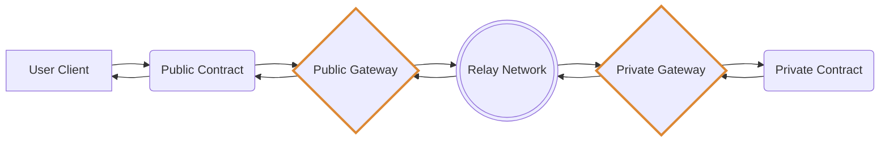

# TNLS-Gateways

```mermaid
flowchart LR
      A[User Client]-->B(Public Contract);
      B-->C{Public Gateway};
      C-->D(((Relay Network)));
      D-->E{Private Gateway};
      E-->F(Private Contract);
      F-->E;
      E-->D;
      D-->C;
      C-->B;
      B-->A;
      style E stroke:#d83,stroke-width:3px;
      style C stroke:#d83,stroke-width:3px;
```
