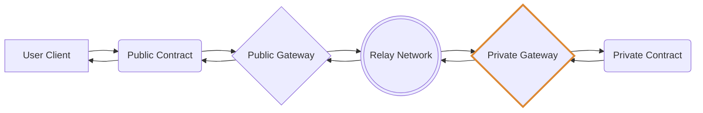

# TNLS-gateways



## Private Gateway Interfaces

### Messages
```rust
pub struct InitMsg {
    /// Entropy used for Prng seed.
    pub entropy: String,
    /// Optional admin address, env.message.sender if missing.
    pub admin: Option<HumanAddr>,
}

pub enum HandleMsg {
    Input { inputs: PreExecutionMsg },
    Output { outputs: PostExecutionMsg },
}

/// Message received from the relayer.
pub struct PreExecutionMsg {
    /// Task ID generated by the relayer.
    pub task_id: u64,
    /// Handle to be called at destination contract.
    pub handle: String,
    /// Destination contract address and code hash.
    pub routing_info: Contract,
    /// Encryption of (data, routing info, and user info).
    pub payload: Binary,
    /// Unique random bytes used to encrypt payload.
    pub nonce: Binary,
    /// Hash of encrypted input values.
    pub payload_hash: Binary,
    /// Signature of hash of encrypted input values.
    pub payload_signature: Binary,
    /// User verification key / public chain address.
    pub sender_info: Sender,
}

/// Message sent to destination private contract with decrypted inputs.
pub struct PrivContractHandleMsg {
    /// JSON string of decrypted user inputs.
    pub input_values: String,
    /// Handle function to be called in the destination contract.
    pub handle: String,
    /// SHA256 hash of `input_values`.
    pub input_hash: Binary,
    /// Signature of `input_hash`, signed by the private gateway.
    pub signature: Binary,
}

/// Message received from destination private contract with results.
pub struct PostExecutionMsg {
    /// JSON string of results from the private contract.
    pub result: String,
    /// Task ID from private contract for verification.
    pub task_id: u64,
    /// SHA256 hash of decrypted inputs for verification.
    pub input_hash: Binary,
}

/// Message sent to the relayer.
pub struct BroadcastMsg {
    /// JSON string of results from the private contract.
    pub result: String,
    /// Encryption of (data, routing info, and user info).
    pub payload: Binary,
    /// Task ID coming from the gateway.
    pub task_id: u64,
    /// SHA256 hash of (result, packet, task_id).
    pub output_hash: Binary,
    /// `output_hash` signed by the private gateway.
    pub signature: Binary,
}

pub enum QueryMsg {
    /// Returns the gateway's public encryption key.
    GetPublicKey {},
}

pub struct PublicKeyResponse {
    pub key: Binary,
}
```

### Types
```rust
/// A packet containing user message data.
/// It is encrypted with a shared secret of the user's private key and the Private Gateway's public key.
pub struct Payload {
    /// Input values as JSON string.
    pub data: String,
    /// Destination contract on private network.
    pub routing_info: Contract,
    /// User verification key / public chain address.
    pub sender: Sender,
}

/// Standard CosmWasm contract format.
pub struct Contract {
    /// Contract address.
    pub address: HumanAddr,
    /// Contract code hash.
    pub hash: String,
}

/// Information about the User.
pub struct Sender {
    /// User public chain address.
    pub address: HumanAddr,
    /// User verification key.
    pub public_key: Binary,
}

```
